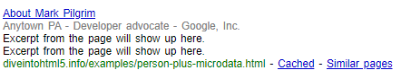

## Introducción

Cuando se hicieron los estándares web, muchos `semantic` debieron quedarse fuera, cual es la opción si quieres agregar los tuyo por razon es que tengas, una opción es usar microformats, otra es usar el RDFa, creado originalmente para XHTML, pero nosotros veremos como usar `microdata`

## ¿Qué es Microdata?

La `microdata` anotan el DOM con pares de nombre/valor delimitados por alcance a partir de vocabularios personalizados, Veamos esto desde el inicio, piensa en un set de elementos HTML5 como un vocabulario, este vocabulario tiene palabras para representar unos elementos pero no para otros, la microdata te permite crear tu propio vocabulario y usarlo para representar los elementos que quieras representar, lo siguiente a notar es que microdata funciona con pares de nombre/valor, esto significa que tu declaras un nombre para tu elemento y una propiedad, y dependiendo de en donde la declares las reglas para obtenerla serán diferentes, junto a estas propiedades microdata depende mucho del concepto de `scoping`, básicamente el scoping es como la relación padre-hijo de los elementos DOM, de la misma forma que un elemento puede tener varios hijos y esos hijos a su vez más hijos, microdata funciona en base a que todas las propiedades de este elemento son de un vocabulario, lo que permite varios vocabularios por pagina, la microdata esta diseñada para trabajar a la par de HTML, no por su cuenta, por lo que es más un complemento para añadir más vocabulario a HTML

## El modelo de datos de Microdata

Definir tu propio vocabulario es sencillo, primero necesitas un `namespace`, el caul es solo un URL, esta puede apuntar a una pagina funcional, o no, esto no es un requerimiento, aunque es mejor si usas un dominio que tu poseas, supongamos que quieres crear el elemento person, entonces puedes usar el URL http://data-vocabulary.org/Person, y digamos que quieres usar tres propiedades

- name (nombre de la persona)
- photo (el link a una foto tuya)
- url (el link a un sitio asociado a ti)

Algunas de estas propiedades son URLs otras son texto, cada una lleva a un tipo de `markup` ya existente, digamos por un momento que creas una pagina `about you`, el nombre este en un `<h1>`, la photo en un elemento `` y los links a otras paginas son hyperlinks, y digamos que esta sección esta en un elemento `<section>`, por ende

```
<section>
  <h1>Mark Pilgrim</h1>
  <p></p>
  <p><a href="http://diveintomark.org/">weblog</a></p>
</section>
```

El modelo de microdata es

| Elemento | Valor |
|----------|-------|
| `<meta>` | Contenido |
| `<audio>` | Source |
| `<embed>` | Source |
| `<iframe>` | Source |
| `` | Source |
| `<source>` | Source |
| `<video>` | Source |
| `<a>` | Href |
| `<area>` | Href |
| `<link>` | Href |
| `<objeto>` | Data |
| `<time>` | Datatime |
| `<otros elementos>` | texto |
Estas propiedades funcionan igual en base a pares nombre/valor, y si quieres agregar tus pares, solo tienes que agregar los tuyos a los existentes de HTML, primero declaras que vocabulario de microdata estas usando, esto se hace añadiendo el atributo `itemtype`, luego declaras el `scope` del vocabulario usando el atributo `itemscope`, en este caso, el elemento al que queremos añadir esta en el elemento `section`

```
<section itemscope itemtype="http://data-vocabulary.org/Person">
```

El primer dato que queremos agregar el tu nombre, por lo que sabemos este esta dentro de un `<h1>`, y este cae dentro de `otros elementos`, por lo que sera texto

```
<h1 itemprop="name">Mark Pilgrim</h1>
```

Ahora la foto, esta tiene que ser un URL, y de acuerdo al modelo el valor de un elemento `` es Source, como ya es una foto solo tienes que declarar que `` es la propiedad photo

```
<p></p>
```

Y al final la propiedad url también es un URL, de acuerdo al modelo el valor del elemento `<a>` es un href, solo tienes que decir que el elemento `<a>` es la propiedad url

```
<a itemprop="url" href="http://diveintomark.org/">dive into mark</a>
```

en el código

```
<TABLE>
  <TR><TD>Name<TD>Mark Pilgrim
  <TR><TD>Link<TD>
    <A href=# onclick=goExternalLink()>http://diveintomark.org/</A>
</TABLE>
```

Para marcar el nombre de una propiedad solo tienes que agregar el atributo itemprop en el atributo de la celda de la tabla que contenga el nombre, como no tiene reglas especiales del modelo microdata solo lo tomara como texto

```
<TR><TD>Name<TD itemprop="name">Mark Pilgrim
```

Al no usar el atributo `<a>` y usando el atributo href que ademas usa JavaScript, es diferente a nuestro caso anterior, en cambio tienes que agregar un `wrapper` para que puedas agregar la propiedad de manera correcta sin tantas complicaciones

```
<TABLE itemscope itemtype="http://data-vocabulary.org/Person">
  <TR><TD>Name<TD>Mark Pilgrim
  <TR><TD>Link<TD>
    <span itemprop="url">
      <A href=# onclick=goExternalLink()>http://diveintomark.org/</A>
    </span>
</TABLE>
```

Como `<span>` entra en el modelo de otros elementos, tomara esto como texto, esto causa que lea como texto el texto, pero el elemento `<a>` y el link no

## Marking up People

| Propiedad | Descripción |
|-----------|-------------|
| name | Nombre |
| nickname | Apodo |
| photo | Un link a una imagen |
| title | El titulo de la persona |
| role | El rol de la persona |
| url | El link a una pagina web |
| affiliation | El nombre de la organización a la que la persona esta asociada |
| friend | Identifica una relación de una persona con otra |
| contact | Identifica una relación de una persona con otra |
| acquaintance | Identifica una relación de una persona con otra |
| address | La localización de una persona, la cual puede tener varias sub-propiedades como: street-address, locality, region, postal-code, y country-name |

Los ejemplo de la sección anterior son reales, y es una buena idea hacer un `markup` para personas, la forma más fácil es incluir una pagina `about you` asi que veamos un ejemplo

Este es un about you page en

```
<section>
  

  <h1>Contact Information</h1>
  <dl>
    <dt>Name</dt>
    <dd>Mark Pilgrim</dd>

    <dt>Position</dt>
    <dd>Developer advocate for Google, Inc.</dd>

    <dt>Mailing address</dt>
    <dd>
      100 Main Street<br>
      Anytown, PA 19999<br>
      USA
    </dd>
  </dl>
  <h1>My Digital Footprints</h1>
  <ul>
    <li><a href="http://diveintomark.org/">weblog</a></li>
    <li><a href="http://www.google.com/profiles/pilgrim">Google profile</a></li>
    <li><a href="http://www.reddit.com/user/MarkPilgrim">Reddit.com profile</a></li>
    <li><a href="http://www.twitter.com/diveintomark">Twitter</a></li>
  </ul>
</section>
```

Lo primero es declarar el vocabulario a usar y el `scope de las propiedades que quieres añadir` esto lo haces añadiendo `itemtype` y el `itemscope` en los elementos externos y en los que contienen la información, por ejemplo

```
<section itemscope itemtype="http://data-vocabulary.org/Person">
```

Ahora puedes empezar a definir las propiedades del microdata del vocabulario `http://data-vocabulary.org/Person` en tu navegador, La especificación de la microdata no es obligatoria pero es una buena practica porque ayuda a que otros usen tu vocabulario, ademas puedes usar el URL para más practicidad
El primer elemento en el que usaremos el vocabulario es la imagen de la foto, para hacer esto solo demos agregar el itemprop="photo"

```

```

Podemos ver como se usa el link de la misma forma de la que se usa en un `<src>` ademas de que al ser hijo del elemento `<section>` vuele a usar la relación con el vocabulario declarado en esta sección, por lo que solo tenemos que usar el `scope`

```
<h1>Contact Information</h1>
<dl>
  <dt>Name</dt>
  <dd>Mark Pilgrim</dd>
```

En este pedazo de código el `<h1>` el `<d1>` y el `<dt>` no tienen microdata, no todo debería tener microdata, así que, que es lo que tiene microdata, el elemento `<dd>` o el nombre

```
<dd itemprop="name">Mark Pilgrim</dd>
```

Las dos siguientes elementos tiene un `markup` algo más complicado, el código antes de la microdata es

```
<dt>Position</dt>
<dd>Developer advocate for Google, Inc.</dd>
```

Si nos damos cuenta, en `<dd>` hay dos pedazos de información en la que hat microdata, `title` y `affiliation` asi que para poder usar estos elementos de microdata, deberíamos usar `<span>` para separar estos pedazos de texto

```
<dt>Position</dt>
<dd><span itemprop="title">Developer advocate</span> for
    <span itemprop="affiliation">Google, Inc.<span></dd>
```

Esta relación también es util para direcciones, puedes ver las relaciones como

- Person
- Person.address
- Person.address.street-address
- Person.address.locality
- Person.address.region
- Person.address.postal-code
- Person.address.country-name

En el ejemplo que usamos la dirección de la calle esta contenida en un solo elemento `<dd>` sabiendo eso, sabemos que tenemos que añadir el itemprop en el elemento `<dd>`

```
<dt>Mailing address</dt>
<dd itemprop="address">
```

Pero recordemos que la dirección es un microdata por si mismo, lo que significa que debemos agregar el `itemscope` y el `itemtype`

```
<dt>Mailing address</dt>
<dd itemprop="address" itemscope
    itemtype="http://data-vocabulary.org/Address">
```

Como con los elementos `<section>`, los elementos `<dd>` también pueden tener hijos, como los son los `<span>` estos también heredarían las propiedades de sus padres como se pude ver en el ejemplo

```
<dd itemprop="address" itemscope
    itemtype="http://data-vocabulary.org/Address">
  <span itemprop="street-address">100 Main Street</span><br>
  <span itemprop="locality">Anytown</span>,
  <span itemprop="region">PA</span>
  <span itemprop="postal-code">19999</span>
  <span itemprop="country-name">USA</span>
 </dd>
</dl>
```

Solo hay una cosa que falta en esta pagina `about you` la lista de los URLs, para estos esta la propiedad url, esta funciona para cualquier URL funcional, y también es importante saber que una persona puede tener varios url o varias propiedades de las anteriores, asi que en este caso podemos aprovecharlos

```
<h1>My Digital Footprints</h1>
<ul>
  <li><a href="http://diveintomark.org/"
          itemprop="url">weblog</a></li>
  <li><a href="http://www.google.com/profiles/pilgrim"
          itemprop="url">Google profile</a></li>
  <li><a href="http://www.reddit.com/user/MarkPilgrim"
          itemprop="url">Reddit.com profile</a></li>
  <li><a href="http://www.twitter.com/diveintomark"
          itemprop="url">Twitter</a></li>
</ul>
```

### Introduciendo Google Rich Snippets

Hay dos principales usos de la microdata, no solo es agregar semántica porque si

1. Navegadores web
2. Buscadores web

Para los navegadores, HTML5 definen una serie de DOM APIs para extraer información de los objetos de microdata, propiedades, y valores, para una pagina web, para el 2011 no hay APIs que hagan esto específicamente, esperemos que esto cambie
Los buscadores web pueden utilizar la microdata para poder mostrar una mejor interfaz con más información e información util en lugar de solo el titulo de la pagina
Google tiene soporte para la microdata como parte de su programa de Rich Snippets, cuando este detecta propiedades de microdata que conforman una pagina, esta se almacena junto con el resto de tu pagina, de hecho, Google te provee de una herramienta para visualizar tus propiedades, y se puede ver como

```
Item
  Type: http://data-vocabulary.org/person
  photo = http://diveintohtml5.info/examples/2000_05_mark.jpg
  name = Mark Pilgrim
  title = Developer advocate
  affiliation = Google, Inc.
  address = Item( 1 )
  url = http://diveintomark.org/
  url = http://www.google.com/profiles/pilgrim
  url = http://www.reddit.com/user/MarkPilgrim
  url = http://www.twitter.com/diveintomark

Item 1
  Type: http://data-vocabulary.org/address
  street-address = 100 Main Street
  locality = Anytown
  region = PA
  postal-code = 19999
  country-name = USA
```

Se pueden observar todas las propiedades que usamos en este ejemplo

En esta imagen podemos ver como se muestra la información sacada de la microdata en la segunda linea de la descripción

Asi como vimos un ejemplo para una persona, también podemos crear microdata para otros nichos, pero como seria redundante mostrar el código usado, solo veremos las propiedades que puedes usar

## Organizaciones

| Propiedad | Descripción |
|-----------|-------------|
| name | El nombre de la organización |
| url | El link a la pagina principal de la organización |
| address | La locación de la organización que puede tener sub-propiedades como: street-address, locality, region, postal-code, y country-name. |
| tel | El número telefónico de la organización |
| geo | Especifica las coordenadas geográficas de la localización que también incluye las sub-propiedades latitud y longitude |

## Eventos

| Propiedad | Descripción |
|-----------|-------------|
| summary | El nombre del evento |
| url | El link de una pagina con detalles del evento |
| location | La locación del evento, puede ser una dirección |
| description | Una descripción del evento |
| startDate | La fecha y hora del inicio del evento en formato ISO |
| endDate | La fecha y hora del final del evento en formato ISO |
| duration | La duración del evento en formato ISO |
| eventType | La categoría del evento, este es un `string` y no un atributo enumerado |
| geo | Especifica las coordenadas geográficas de la localización que también incluye las sub-propiedades latitud y longitude |
| photo | El link a una foto relacionada al evento |

## Reviews/Reseñas

| Propiedad | Descripción |
|-----------|-------------|
| itemReviewed | El nombre del objeto que recibe una reseña |
| rating | Un valor numérico que representa la calidad del objeto en una escala del 1 al 5 o puedes crear una escala no tradicional como estas propiedades |
| reviewer | El nombre del autor de la reseña |
| dtReviewed | La fecha en la que se publico la reseña en formato ISO |
| summary | Un pequeño resumen de la reseña |
| description | EL cuerpo de la reseña |

[Ejemplo](https://github.com/IIKUYY/HTML5/tree/main/Ch10/Ejemplo)

[Menú](https://github.com/IIKUYY/HTML5/tree/main)